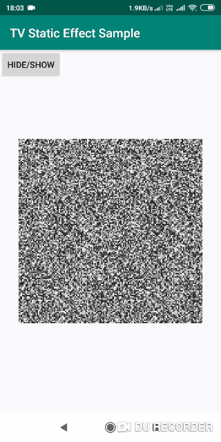

# AnalogTvNoiseView

Analog TV noise effect for android.

## Setup
- **Step 1** Add repository into root build.gradle

~~~gradle
allprojects {
    repositories {
    ...
    maven {
        url 'https://jitpack.io' }
    }
}
~~~

- **Step 2** Add library dependency into app build.gradle

> See the jitpack badge above for the latest version number

~~~gradle
dependencies {
	        implementation 'com.github.abdularis:AnalogTvNoiseView:<latest-version>'
	}
~~~

## Usage

~~~xml
<com.abdularis.app.analogtvnoise.AnalogTvNoise
        android:id="@+id/noise"
        android:layout_width="300dp"
        android:layout_height="300dp"/>
~~~